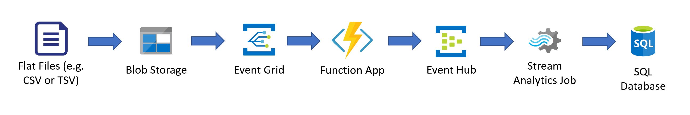
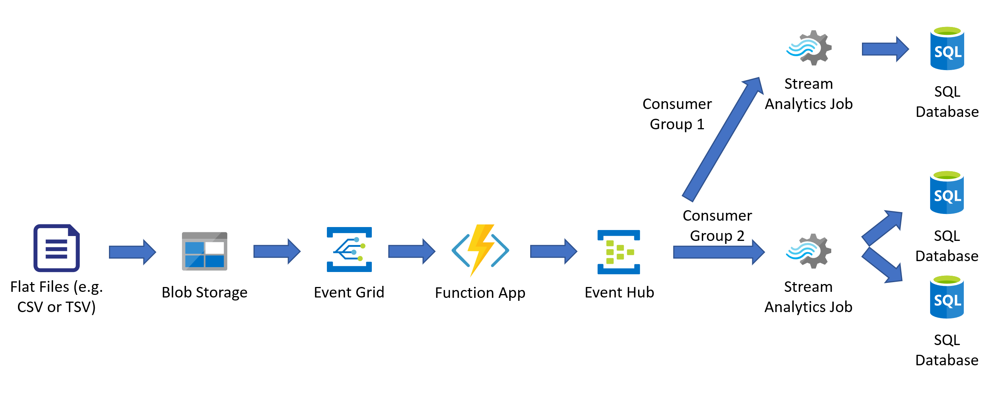
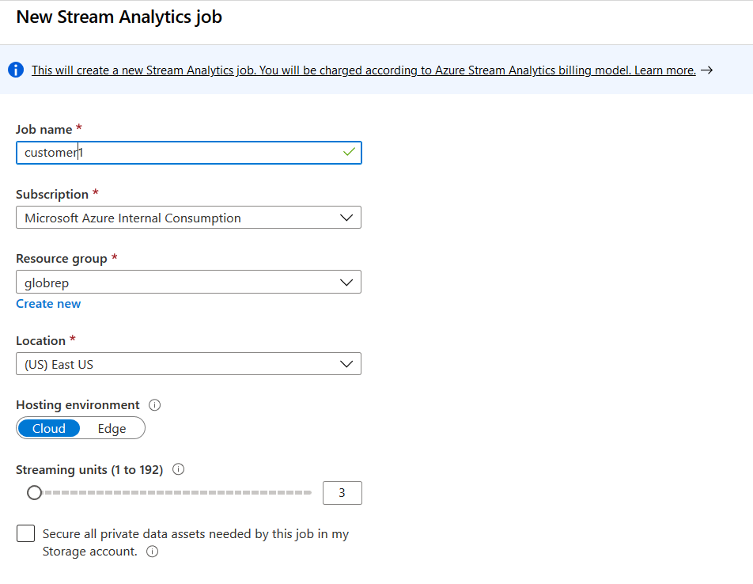
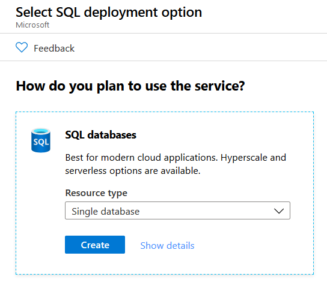
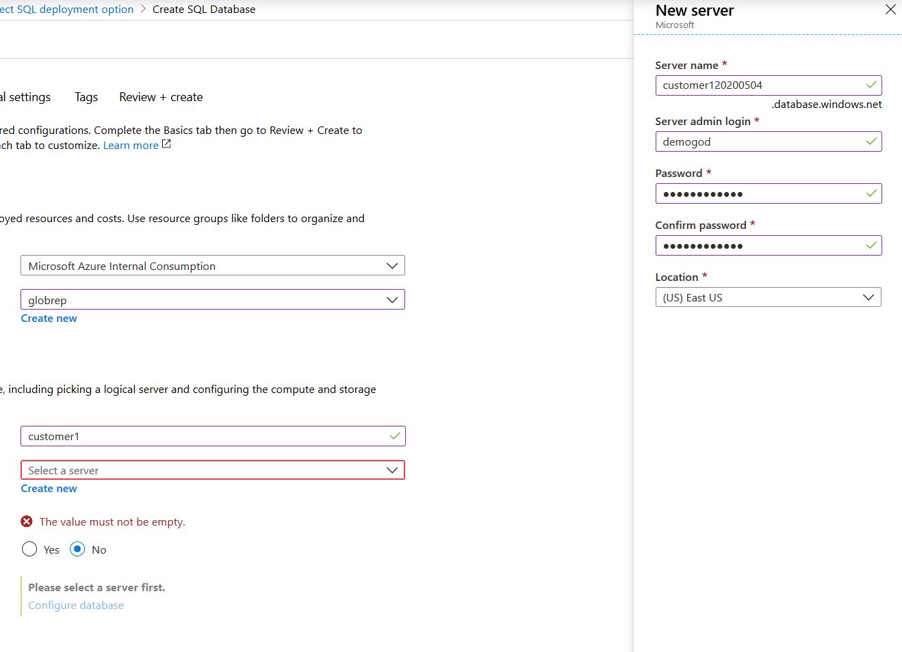
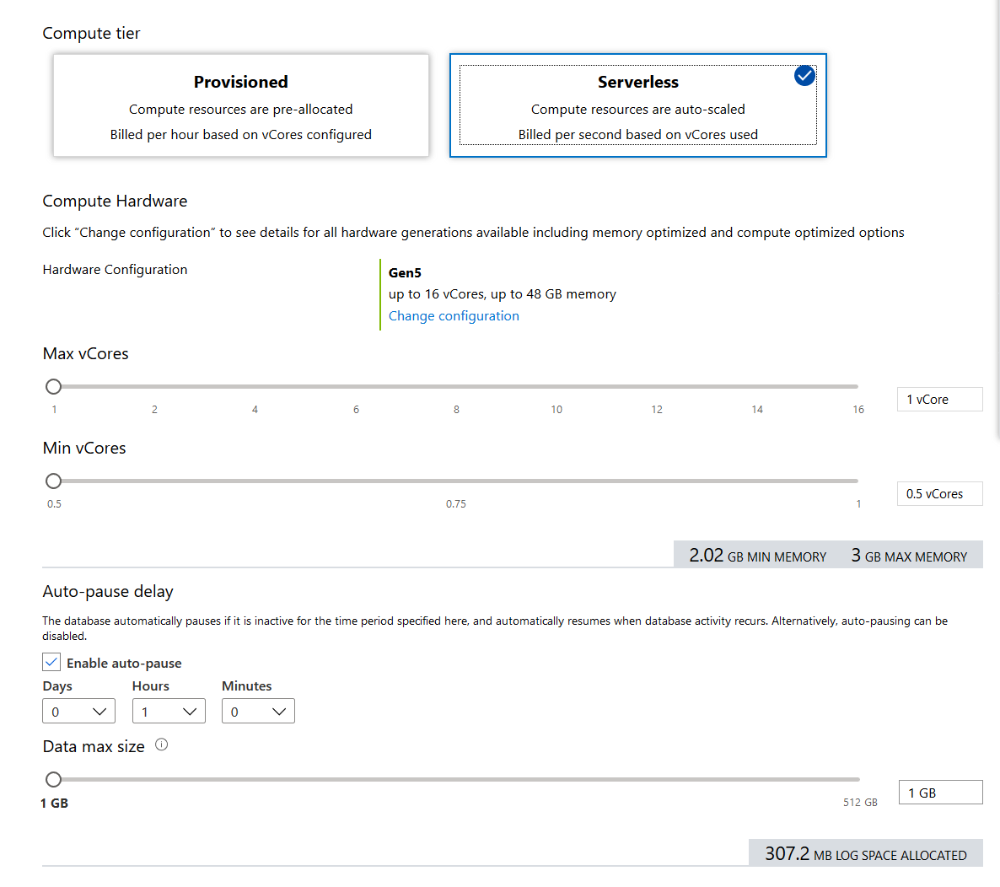
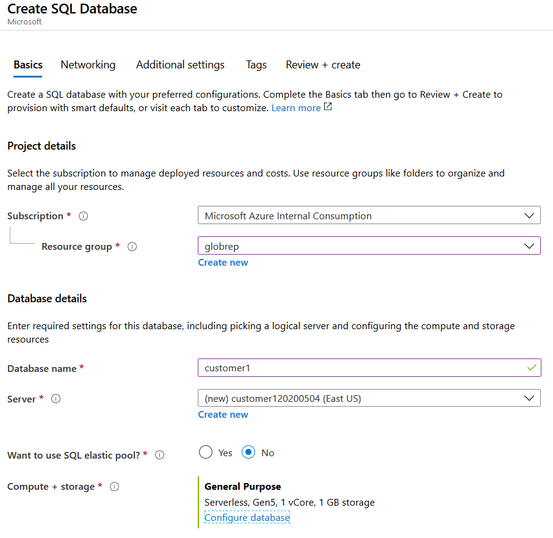
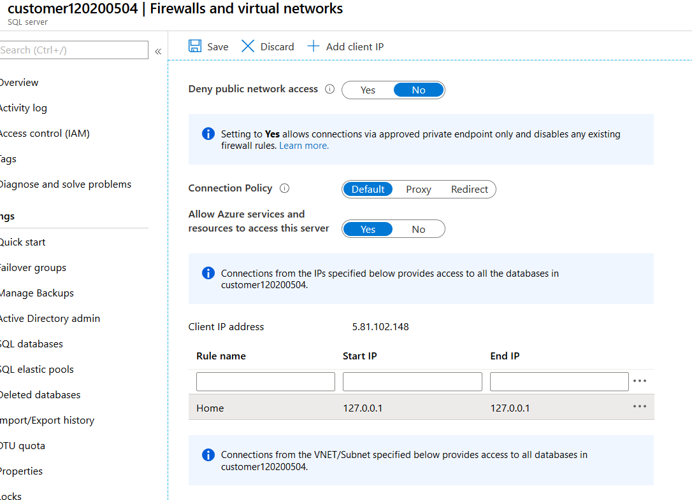
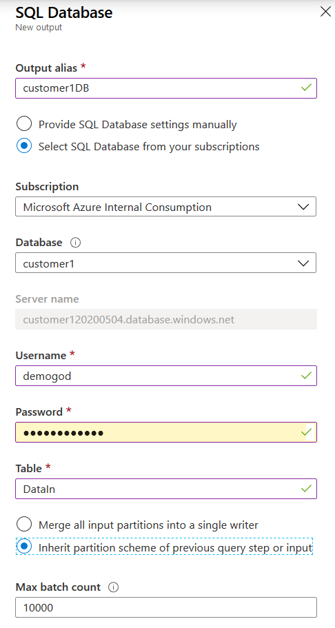
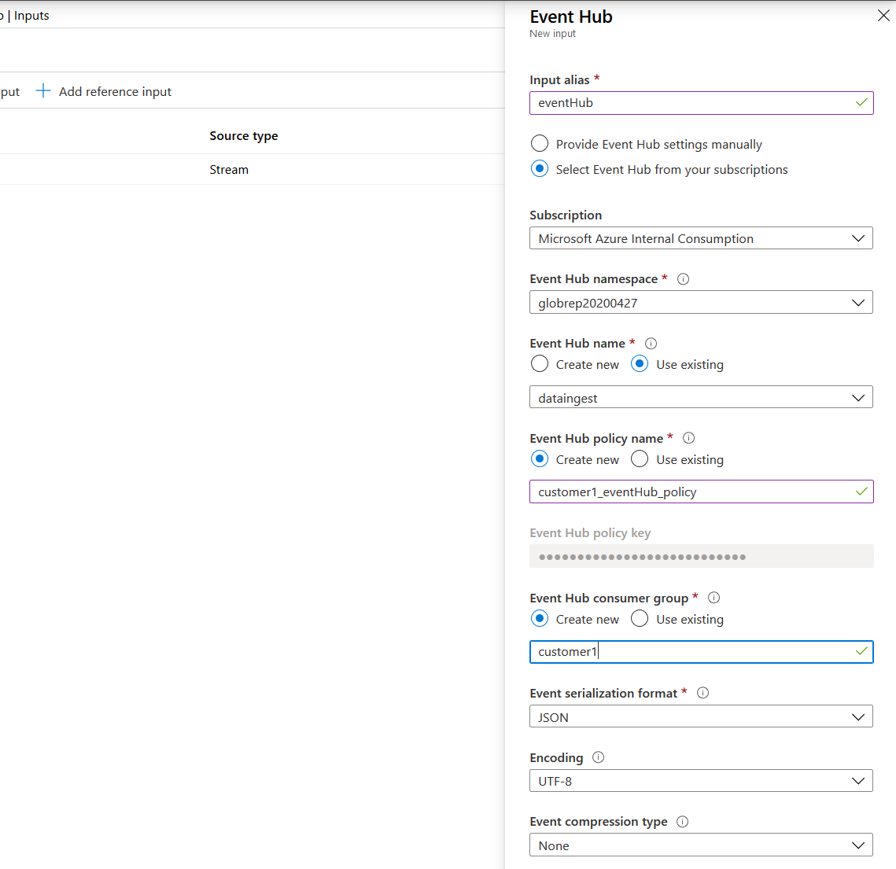

# Global Data Replication

**Produced by Dave Lusty**

## Introduction

This demo came from a customer problem where large quantities of data must be ingested and replicated to other sites around the world with low latency. Filtering of data is also a requirement to deliver to different customers downstream. The data arrives as a flat text file with tab separated values. As you'll recall I created a [recent demo](https://github.com/davedoesdemos/CSVBlobToEventHub/blob/master/README.md) which ingested CSV files to Event Hubs. This will allow us to do the global distribution before hitting the databases, ensuring the lowest possible latency in all locations. For this I also considered copying the flat files to many locations, but that would add latency since the file copy would need to complete before the first event is fired. With the architecture below we start making events immediately, so individual events are sent globally, each taking milliseconds where the file copy may have taken seconds before starting. In theory, this could also be mixed up with [this demo](https://github.com/davedoesdemos/dataupload) to allow people to drop CSV files into a web interface and turn them into an event stream.

### Architecture

The basic architecture for the demo is shown below. Files will be copied into a storage account (either Blob or ADLS Gen 2). This will then trigger a function app (the one from the previous demo) which will either use a blob trigger (simpler) or an EventGrid trigger (more complex, but shorter start time). The function app will open the file and turn it into JSON events line by line to be sent into Event Hubs. A Stream Analytics job is then used as a consumer of the Event Grid to filter events and send them to a SQL database.



Moving this to a multi-tenant architecture is very straightforward. Extra Stream Analytics jobs can be configured with their own consumer groups in Event Hubs. This allows each one to track its position in the data individually, and to separate the work of filtering and delivery. As such, the query used in Stream Analytics is customer specific, allowing their data to be delivered to multiple destinations or to include just the data they need. In terms of global distribution, there is a choice as to whether Stream Analytics is in the source or destination region. I couldn't see a good reason either would be preferred, although since there is a filter operation there will be less data transfer after the job, making it slightly cheaper and more efficient to host in the source region. There is no difference in latency since in both cases events are processed individually so latency is per event not per data run so every event will be processed with the same geographical latency whether local or remote processed. Similarly I couldn't see any large benefit/drawback when comparing one job delivering to two databases or two jobs for two databases running in parallel. In theory two jobs is better as it allows one database to gracefully fail and recover.



### Data

The data used for this demo came from NASDAQ but is public data and alternatives are available from various locations with similar data. You can find my data files in the sample data firectory of the repository. I chose their top few stock data sets and added a column for the symbol (which wasn't in the original data) just so we can later filter by that. Obviously your data would normally include the fields you're going to filter on. I could have achieved the same by placing the files into individual folders and adding the stock symbol using the function app code before submission, but this seemed easier since it's not really core to the demo.

```
Symbol,Date, Close/Last, Volume, Open, High, Low
AMD,04/24/2020, $56.18,72854750, $55.1, $56.78, $54.42
AMD,04/23/2020, $55.9,69662690, $56.65, $57.285, $55.64
AMD,04/22/2020, $55.92,63164080, $54.91, $56.15, $54.34
AMD,04/21/2020, $52.92,123906400, $56.9, $57.73, $51.41
AMD,04/20/2020, $56.97,72366360, $55.98, $58.63, $55.85
AMD,04/17/2020, $56.6,76908780, $57.35, $57.755, $55.55
AMD,04/16/2020, $56.95,103106500, $55.96, $58.08, $55.63
AMD,04/15/2020, $54.99,83814030, $53.73, $55.5699, $53.41
```

## Infrastructure

For this demo, deploy the function app as per the previous demo, along with the Event Hub. You probably want to reduce the delay to 0 for this demo rather than the 1000ms I set in that code (to allow you time to see things working), otherwise there will be huge delays in processing. In addition to this, you'll need two Stream Analytics Jobs in the same region, and two Azure SQL Databases with one in the source region and one in any other region around the world.

**I'm assuming you have followed the [other demo](https://github.com/davedoesdemos/CSVBlobToEventHub/blob/master/README.md) and already have that deployed**

### Stream Analytics Jobs

When creating the Stream Analytics job choose cloud hosting and 1 streaming unit, place both in the same region as your Event Hub from the previous demo. Give the two jobs obvious names such as customer1 and customer2. Feel free to experiment with differing regions and see for yourself what the performance impact of this would be.



### SQL Databases

When deploying the SQL databases, choose single database as the deployment option in Azure SQL.



Next, you'll need to create a server for each database since they will be in different regions. Name the servers customer1**DATE** and customer2**DATE** (replace **DATE** with the current date or a random string) to that they are globally unique, and use the admin username "Demogod" as usual. For the first database, choose the region where your Event Hub is located, for the second choose a region a long way away geographically.



Name the databases customer1 and customer 2 to allow easy identification in your demo.

Select serverless with the smallest capacity you can to keep demo costs down. If you're testing to ensure performance and low latency then these can be increased or pre-provisioned, but to see the demo working that's not necessary.



Your new database config should now look like the below hit review and create and then create to complete. Repeat this in your second region with customer 2 if you have not already done so.



Once created, you'll need to set up the firewall on the SQL Server (Server, not database!). Go to Firewalls and Virtual Networks on the side menu for your SQL Server (do this on both). Here, you need to allow access from Azure services (this will be the Stream Analytics job) as well as adding your own IP to allow you to run queries. In the image below I used 127.0.0.1 for illustration, obviously you need to use your public IP address here which you can find by searching "my IPV4 address" on any search engine or looking at your router configuration.



**Please note** that there are many ways to configure security here, this is just one that I'm using for the demo. It is secure, the SQL server still requires authentication and authorisation and traffic can only originate from the Azure network. Some organisations may require private connections only, and these organisations are well used to dealing with the added complexity that will bring so I won't go into that complexity here - for almost everyone it's not necessary anyway. I do, however, recommend removing the private IP address when you're finished. These may change and in general you shouldn't be connecting to the system often enough to need a permanent rule.

## Configuration

Once deployed, the first task is to set up the SQL database to have a taget table to ingest the data

### SQL Database

To keep things simple, we'll just be taking some of the available fields and storing them in SQL Server. Create the database table with the below query.

```SQL
CREATE TABLE DataIn(
"Symbol" text,
"Date" DateTime,
"Volume" int,
"Open" text,
"High" text,
"Low" text,
"PartitionId" int
)
```

For testing purposes we'll be using the following queries. I also added a column with a timestamp in SQL Server using `timestamp DATETIME NULL DEFAULT GETDATE()` as an extra column for testing latency in one of my tests. While this did show that there was minimal latency in the system, it does significantly slow down SQL Server since it has to generate thousands of timestamps internally and requires more processing power. As such I have left it off here, but you can use that to compare to the generated timestamp in Stream Analytics, and the job time in the function for basic performance testing. Please note that the wall clocks in some of these services are not guaranteed accurate or that they will align, so take the results with a pinch of salt. They will show you within a second though, and you can see how latency builds on a large ingest over time to tune the SQL Server sizing.

This query will show you how many records are present - this should match with the source data when complete assuming you delete all rows bwteen runs. Useful to see how long overall processing took.
```SQL
select count (*) from DataIn
```

This query will show you the actual data rows (top 10) which can be useful to verify the correct data rows were filtered.

```SQL
select TOP 10 * from DataIn
```

### Stream Analytics Job

To set up the Stream Analytics job, we first need to configure the output. Click on Outputs on the menu and then Add. Configure this to your SQL Server to match the job (customer1/customer2, you need to configure both). Add in the SQL credentials and "DataIn" as the table. I chose to inherit the partition scheme since this will parallelise the incoming data for SQL, but in some cases you may need to merge. For the demo it will make very little difference.



Click Test to try out the connection and ensure you get a success. If you don't then your SQL Server firewall is likely to be the issue, go back and check this using the instructions above. Once successful click Save.

Next, click Inputs and then Add Stream Input and choose Event Hub. Add an input alias of "EventHub" and choose your hub. Use the existing Event Hub name and then create a new policy and consumer group called "customer1" or "customer2" depending which you are working on. The new policy and consumer group ensure that this Stream Analytics job has its own configuration and can be removed completely later on if needed without overlap. More importantly, the consumer group allows this job to track its own progress. If two jobs process one consumer group they will share a marker so that each event is only processed once. Since we want each customer to process all events, each customer gets their own consumer group with their own marker.



Now that we have an input and output, click on Query and add the following. This will select the columns as well as creating a timestamp so you can see when this event was processed. The timestamp is not necessary and should be removed for normal uses.

```sql
with customerData as (
  SELECT "Symbol", System.Timestamp() "Date", "Volume", "Open", "High", "Low", "PartitionId" FROM eventhub
)

Select *

INTO
    customer1DB
FROM
    customerData
```

Click test query to verify the output and then click save. If you want to filter by stock symbol, you could add a WHERE clause to the query to allow for this:

```SQL
with customerData as (
  SELECT "Symbol", System.Timestamp() "Date", "Volume", "Open", "High", "Low", "PartitionId" FROM eventhub WHERE "Symbol" = 'AAPL'
)

Select *

INTO
    customer1DB
FROM
    customerData
```

If you wanted to send your data to two outputs, you could add two INTO statements like this to use one job for both:

```sql
with customerData as (
  SELECT "Symbol", System.Timestamp() "Date", "Volume", "Open", "High", "Low", "PartitionId" FROM eventhub
)

Select *

INTO
    customer1DB
FROM
    customerData

Select *

INTO
    customer2DB
FROM
    customerData
```

Finally, go to the overview on the menu and click start to run the job. Stream Analytics jobs can take a few minutes to start up so wait for the confirmation before continuing with testing.

## Testing

To test the solution, upload your test data to the blob storage as in the previous demo. This will then be processed into events and fed into the databases. You can see this activity in the monitor tabs of each component. 

Try out the solution with differing scenarios as suggested above using different regions, different queries and different combinations of each to see how it all fits together.